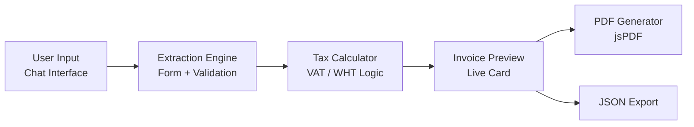

# Nigerian Freelance Invoice Generator — Implementation Plan

## Goal
Build a production-ready, single-page web application that acts as an **AI-powered Nigerian freelance invoicing tool**. The app will guide users through a conversational chat interface, extract invoice data, validate it against Nigerian tax regulations (Tax Act 2025/2026), and generate professional PDF invoices.

---

## Architecture Overview

**Stack:** Pure HTML + CSS + JavaScript (no frameworks, no build tools)



**Key Design Decision:** Since the user's spec describes an "AI consultant" role, but we're building a client-side app without an LLM backend, we'll implement this as a **guided multi-step form with a chat-like UI** that mimics the conversational extraction flow. The app itself handles all validation, tax logic, and PDF generation locally.

---

## User Review Required

> [!IMPORTANT]
> **No AI/LLM Backend:** This will be a fully client-side app. The "AI consultant" behavior from the prompt will be implemented as a smart, guided form with validation — not an actual LLM integration. If you want real AI chat (e.g., via OpenAI API), please let me know and I'll adjust the plan.

> [!IMPORTANT]
> **Payment Links:** Paystack/Flutterwave integration will be a manual URL input field on the invoice (not a live API integration). Full payment gateway integration would require API keys and a backend.

---

## Proposed Changes

### File Structure

```
OpenCode/
├── index.html          # Main app shell
├── style.css           # Complete design system + all styles
├── app.js              # Core application logic
├── invoice-engine.js   # Tax calculation, validation, JSON schema
└── pdf-generator.js    # jsPDF-based PDF creation
```

---

### UI / UX Design

**Theme:** Dark mode with Nigerian green (#008751) and white (#FFFFFF) accent palette — inspired by the Nigerian flag. Glassmorphism cards, smooth transitions, and premium typography (Inter font).

**Layout — 3 Panels:**

| Left Sidebar | Center Panel | Right Panel |
|---|---|---|
| Invoice history list (localStorage) | Multi-step guided form (chat-style) | Live invoice preview card |

**Mobile:** Collapses to tabbed single-panel view.

**Steps in the guided form:**
1. **Seller Details** — Name, address, RC/BN, TIN
2. **Client Details** — Name, address, client type (Individual/Company)
3. **Line Items** — Description, qty, rate (add/remove rows)
4. **Financials** — Auto-calculated subtotal, VAT toggle, WHT (if company client), due date
5. **Payment Info** — Bank name, 10-digit NUBAN, optional Paystack/Flutterwave link
6. **Review & Generate** — Full preview → Download PDF / Export JSON

---

### [NEW] [index.html](file:///c:/Users/Laptop%20%203/OpenCode/index.html)

Main app shell:
- Google Fonts (Inter) via CDN
- jsPDF via CDN (`https://cdnjs.cloudflare.com/ajax/libs/jspdf/2.5.1/jspdf.umd.min.js`)
- Semantic HTML5 layout: `<header>`, `<main>` with 3 sections, `<footer>`
- Step indicator / progress bar
- Modal for invoice preview
- All unique IDs for interactive elements

### [NEW] [style.css](file:///c:/Users/Laptop%20%203/OpenCode/style.css)

Complete design system:
- CSS custom properties for colors, spacing, typography, shadows
- Dark background (#0a0a0f) with glassmorphic cards
- Nigerian green (#008751) primary accent
- Animated step transitions, hover effects, micro-animations
- Responsive breakpoints (mobile-first)
- Print-friendly styles for the invoice preview

### [NEW] [app.js](file:///c:/Users/Laptop%20%203/OpenCode/app.js)

Core application logic:
- Multi-step form navigation (next/back with validation)
- LocalStorage persistence for: invoice history, seller profile (auto-fill), sequential numbering (INV-2026-XXX)
- Dynamic line item add/remove
- Client type toggle (Individual vs Company → triggers WHT)
- VAT registration toggle
- Real-time preview updates
- Form validation (10-digit NUBAN, required fields, date validation)
- `null` handling for missing optional fields (per spec)
- JSON export functionality

### [NEW] [invoice-engine.js](file:///c:/Users/Laptop%20%203/OpenCode/invoice-engine.js)

Tax & calculation engine:
- `calculateSubtotal(lineItems)` → sum of qty × rate
- `calculateVAT(subtotal, isRegistered)` → 7.5% or 0
- `calculateWHT(subtotal, clientType)` → 5% if company, else 0
- `calculateTotal(subtotal, vat, wht)` → (subtotal + vat) - wht
- `validateInvoiceData(data)` → returns errors array
- `generateInvoiceNumber(lastNumber)` → INV-2026-XXX sequential
- `buildInvoiceJSON(formData)` → complete JSON per the output schema

### [NEW] [pdf-generator.js](file:///c:/Users/Laptop%20%203/OpenCode/pdf-generator.js)

PDF generation with jsPDF:
- Professional invoice layout with Nigerian green header
- Seller/Buyer info blocks
- Line items table
- Financial summary with VAT/WHT breakdown
- Bank details and payment link (if provided)
- Footer with invoice number and generation date
- A4 format

---

## Key Features Checklist

| Feature | Implementation |
|---|---|
| Sequential numbering (INV-2026-XXX) | LocalStorage counter, auto-increment |
| VAT 7.5% (conditional) | Toggle based on user confirmation |
| WHT 5% (conditional) | Auto-applied when client type = "Company" |
| NULL handling | Missing optional fields → `null` in JSON |
| 10-digit NUBAN validation | Regex + length check |
| RC/BN field | Optional text input |
| Specific due dates | Date picker, no "On Delivery" option |
| Paystack/Flutterwave link | URL input field |
| Invoice history | LocalStorage array, sidebar list |
| PDF download | jsPDF, A4 layout |
| JSON export | Clipboard copy + file download |
| Seller profile auto-fill | LocalStorage persistence |

---

## Open Questions

> [!IMPORTANT]
> 1. **Do you want real AI/LLM integration** (requires an API key and backend), or is the smart guided form approach sufficient?

> [!IMPORTANT]
> 2. **Should the app support editing previously saved invoices**, or is it generate-only (create new, view history)?

> [!NOTE]
> 3. **Currency formatting** — Should amounts display as `₦1,500,000.00` or `NGN 1,500,000.00`?

> [!NOTE]
> 4. **Logo upload** — Should the freelancer be able to upload their business logo for the PDF header?

---

## Verification Plan

### Automated Tests
- Open the app in browser and test each form step
- Verify tax calculations: e.g., Subtotal ₦100,000 → VAT ₦7,500 → WHT ₦5,000 → Total ₦102,500
- Test sequential numbering across page reloads
- Test PDF download produces valid file
- Test JSON export matches expected schema
- Test responsive layout at 375px, 768px, 1440px widths

### Manual Verification
- Visual review of UI aesthetics (dark mode, glassmorphism, animations)
- PDF output quality and formatting
- LocalStorage persistence across sessions
